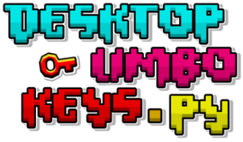

<p align="center">
  
  <p align="center">
    🔑<em> Play with the Limbo Keys on your desktop </em>🪟
  </p>
  <p align="center">
    
    
    
  </p>
</p>

## 🎯 Features

- ⭐ **Family-Friendly Interface**: Designed to be accessible and safe for users of all ages.
- 🔁 **Cross-Platform Compatibility**: Works seamlessly on both Linux and Windows.
- ⚙️ **Easy Configuration**: Utilize JSON for straightforward setup.
- 🛠️ **Fully Customizable**: Tailor settings to fit your preferences.

  
  

## 🚀 Usage

1. **Clone the repository** 🔗
   - Use Git to clone the repository to your local machine:
     ```bash
     git clone https://github.com/impavloh/DesktopLimboKeys
     ```
   - Alternatively, [download](https://github.com/impavloh/DesktopLimboKeys/archive/refs/heads/master.zip) the project directly using the 'Download ZIP' option from the green button.

2. **Navigate to the project directory** 📂
   ```bash
   cd DesktopLimboKeys
   ```

3. **Install requirements** 📦

    - Use pip to install the necessary dependencies:
   ```bash
   pip install -r requirements.txt
   ```
   
4. **Launch the game** ▶️
    - Start the game using Python:
    ```bash
    python menu.py
    ```
    - If you are using Linux, you need to use python3 instead:
    ```bash
    python3 menu.py
    ```

## 📃 Credits
- 🎮 [RobTop](https://x.com/RobTopGames) for providing the game assets, including sprites and sound of [Geometry Dash](https://store.steampowered.com/app/322170/Geometry_Dash/)
- 👾 [Mindcap](https://x.com/MindCap): creator of the Geometry Dash level "[Limbo](https://gdbrowser.com/86084399)"
- 🔑 [Crohn44](https://www.youtube.com/channel/UC_uAx-Nk1tvsVubM9LaJWxQ): final part of Limbo (keys concept)
- 🎵 [NightHawk22](https://nighthawk22.newgrounds.com) for composing the original music "[Isolation](https://www.newgrounds.com/audio/listen/76743)"
- 💻 [Quasar098](https://github.com/quasar098) for the [original code](https://github.com/quasar098/limbos32) related to the animation of the keys and the server-client communication. Initially, I planned to just submit a PR, but was motivated to develop a project from the ground up using his work as inspiration :)
- 📝 Flat-it for the main font used in Geometry Dash

## 💡 Contributing
**Contributions are welcome!** For major changes, please open an [issue](https://github.com/impavloh/DesktopLimboKeys/issues) first to discuss what you would like to change.